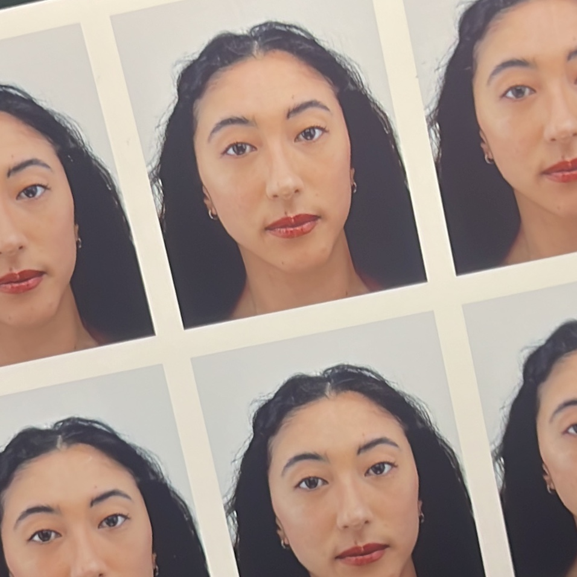

# Hi, my name is Mélanie.

  
  

    
🇫🇷 I am doing my PhD in Political Science at Université Panthéon-Sorbonne in Paris.

    
🇺🇸 I am a visiting researcher in the Department of Sociology at UC Berkeley.

    <h2>Interests</h2>
    
I'm interested in the emergence and institutionalization of digital cultures in government. How is the State going digital? Who is driving the transition?

    <h2>Let's chat</h2>
    
📧 <a href="mailto:melanie.ullmo@univ-paris1.fr">melanie.ullmo@univ-paris1.fr</a>

    <h2>Let's meet up</h2>
    
— May 7–8, 2026 : Code for America Summit 2026 (Chicago, IL)

    
— June 30–July 4, 2026 : Congrès de l'Association Française de Science Politique (Lyon, Fr)

  

